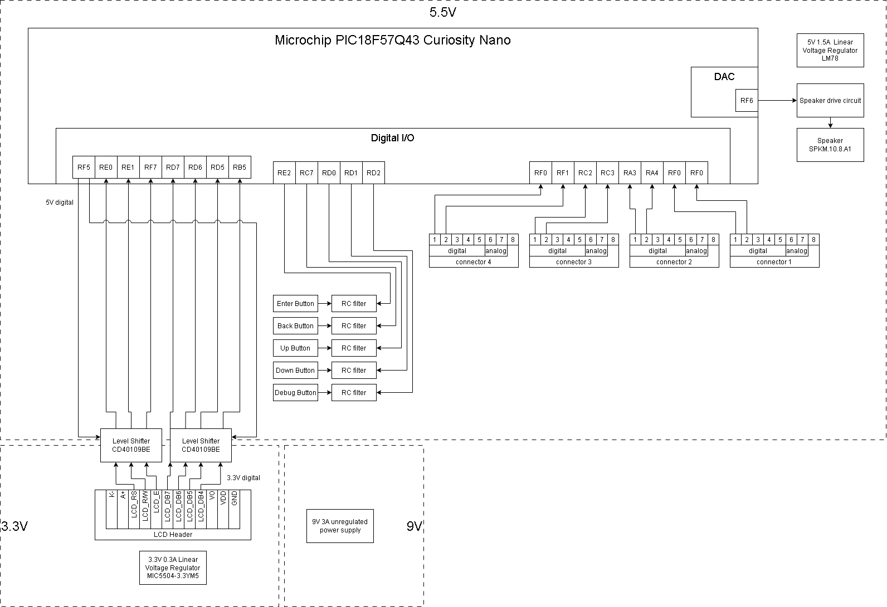

## Overview
The main contribution to this project by myself is the motherboard unit, which will connect, synchronize and provide input/output to the user via buttons, lights, a screen, and a speaker.

* power levels: 
- PIC, speaker and communications between boards will be running at 5V.
- LCD and controller will be running at 3.3V. 3.3V regulator can be operated off 5V or 9V rails.
- 9V will be used to power the 5V and 3.3V rail regulators.
* sensors: 4 buttons will be used for user inputs
* Actuator: A speaker will be used for warnings
* team connections: 3 other teammates will connect via digital signaling to give sensor data in numerial format via UART
* Power source: 9V battery, barrel jack charger or sharing 5V rail with teammates through 8-pin headers.

## Block Diagram 

Link to block diagram:
https://viewer.diagrams.net/?lightbox=1&highlight=0000ff&nav=1&title=EGR304_210_UpdatedIndividual.drawio&dark=auto#R%3Cmxfile%3E%3Cdiagram%20name%3D%22Page-1%22%20id%3D%22NW4bKkYRBSo9kiXSpmwB%22%3E7V1be6M4Ev01eex8CBCXx8RO9%2FR2MpNNdtPTT%2FsRm9hMY%2BMlOJf%2B9SNssLFKNmCBSs7uS7fByIGjU9KpUqk4swazty9psJjeJOMwPjON8duZNTwzTdNyKPsvP%2FO%2BPkNs31ufmaTRuDi3PXEf%2FQqLk0ZxdhmNw%2BedC7MkibNosXtylMzn4SjbORekafK6e9lTEu%2F%2B1UUwCcGJ%2B1EQw7Pfo3E2LR%2FMcrZf%2FBZGk2n5px1qr7%2BZBeXVxaM8T4Nx8lo5ZV2dWYM0SbL1p9nbIIxz%2BEpg1u0%2B7%2Fl2c2dpOM%2BaNIgz4%2Bkx%2FfP6kfhfxw8vy8HVj1%2BfiGGuf%2BcliJfFM5%2BZTsx%2B8XIcveQoxtFkvvrC%2Be8yv9fLEfuDYbo9Zp8m%2Bf%2F0nD6UbdltrJqvvykAyN5LWNNkOR%2BH%2BY0Z7OvXaZSF94tglH%2F7ypjEzk2zWcyOCPv4FMXxIImTlB3Pk3mY31rwPF01J8XBbZCxe8rvk%2FHL8NjZlzDNItaRF8X9Z0n%2Bs0%2FJPCtYZtrsuHy64pnKW62iWgCd%2F174VjlVoPwlTGZhlr6zS4pvLafo8YL0plscv24ZRKhfnJxW2OOWJ4OCtpPNj287ln0o%2BrZFP5e3UOlm69x60KFjZtF4nP%2F5vX0Th09ZPz1DDEHXUEPQM2YXPTOc%2B9%2B%2FhP%2F4%2Bcd1cEfs6e0X8%2BFfnwjomJtolCajabRgp2%2B%2FDoj3mbr%2FtC12NFimUfIcZfkj%2FR7ME7nua2YhHcBuk13YLVNgEBYRwe71ZRCODXAfRpMoC%2FKWX9lP%2FtEzuMTrCFyO0xv6VsE1ReASoy9OQ2wBmBOG5mLv4xfTefBYXm60hYUQaxcXxxfg4ghgcfpChQJUisdkA6hp2N3y7THJsmQmpNjBLqsHGA0%2FB%2BA3Li32NJAr9YCAiMI5py8gXQBkMA%2FiZHIqOL5xoO3H1VYJqwdgJXKI9mm6pkpkfIAMnBBwkXnbSyGlQJXTdFWm64mUjY0U1M2SM2hfSDnYSEEPn%2BqJlIeNlAWQcvREighEvlqooMR3NYUKfUyHut%2FTFCr0QR1KfIBU746jxUUr8B1HAgV71XOUVAiyun3TaRq7jgRqcy18xxbY6eI8EijmdfAeWyCpqfu4GapU%2B4%2FHGbDSicGEal%2BNB9meVthyowRGuQvZHipsuWFCva%2FGh2wPFbYTaUK9r8aJbA8VthdpQr2vxouUmALRsIKCX40beQRW6AM79ALU%2BJFHYIU%2BskO9D6Dq3ZG0%2FV2Bie9ImlC7Vx1JSUklK%2BE3naaxI1kuKuvmSLbAThdH0oKaXgdHsgWSmjqSFvQA1DiSxxmw0onBgpJfjSPZnlbYesOCkl%2BNI9keKmy5YUHJr8aRbA8VtiNpQcWvxpFsDxW2I2lBwa%2FGkZSYAtGwgoJfjSN5BFboAzv0AtQ4kkdghT2y21DvA6h6dyQdd1dg4juSNtTuVUdSUm5KZxI2hxgPQSjStXAkW2CniyNpQ02vgyPZAklNHUkbegCKMlqPMmC1EwOU%2FGocyfa0wtYbNpT8ipJaW0OFLjeg5FeU1doaKmxH0oaKX1Faa2uosB1JGwp%2BRXmtx0%2BBWFhRKPgVJba2xwp7YKfQC1CU2XrEYhw2VlDv3302ukar9e5RkO1KBeO6SHTavQEF1fzd585l5xFAUd2Agur8btC5Bj0CKF83oKBUvxt0rkDbA2VbugEFhfrdhQ5AuboBBWX63UXnQr09UFS7wRyKdC1mPardYA4luh5A6TaYOxCUcDwJ74vDJM2mySSZB%2FHV9uzlLmzba66TvCrHCqy%2Fwix7L0pzBMss2YWSIZi%2B%2F5m3P6fl4Y%2Fqd8O34sfXR%2B%2FF0d4ueE6W6Sg88JyF4WRBOgkPSeFSV%2BYgHOzRNIyDLHrZjeOJumfV9CJNg%2FfKBYskmmfPlV%2B%2BzU9UiLIR2OUaBV%2BNim9g8fU5dhuwD%2Bt72FJl8zAS7IFC8kOyx2%2FKHksT9nBFbBy7jj38kpitgj1QXX9I9pROcD197F7oA7vb9sTdvfmN9a0WzbY8aE3ETWmq8g85NUTka1txDXoiIhTlH5OIpCkRqR7jmMXPgm4dfejBBj3RB7oqH5I%2BZSJsPX2crukjp3HhQsbH7B%2Braf%2B4evUPXD35kP1Trv%2FX94%2Bnx%2FDr8DKB1gy%2FlJeRVMXwCxeUPiZ9aFP6%2BHrQx%2BXybxyrhj4OL%2F6sbukjrFzqoYw%2Bx9PAEYQyxA9G9BrlYezyal342rhcZlkyB92gOjrnceLREyyee4LgnNVBcE7cgygjmwQ1BXES8YN1HmWToyaMFl8Go58aM1Ow%2FK6WmTAxQWtmuoIQjPjBOo%2FgyZWWhekz%2F15ozEtBapZaXvoYvNxqwaoSrAjDzrWgK4jkiAHpPKQox2eY4jRMXuf6MtoXJIUpZbSPu8RCemD08utTQJePzuALnc2%2BjQfh1eDukyC2pEjVHuXceJyn69YFtg1HsoFXFL7syhk61AvVZfMrUzujVLlqLjZKiMmHNEpBQFGRnj%2FKKH0ufuDWxasM3orbNvCoAqMUZHAOJJOomeFl9%2BULtLqyUsTcFrGV4i7rKbNSQVhZkW9znJVyo7lbl5xgeJINPF%2BBlQrSh4eSGWd9WKmPmCUrtlLc1VNlViqI3ivy2I6zUm40d%2BuC94ZsA99SYKWC3PWh5G6IXqwUMUVbbKW4a%2BjKrNRpaqWaZMgY3HDu1uWJ8pviWzfwXQVmKtg5McT3Q4mBuCFAbJYo6dvHm5eLZl5NYT5029WoZfi4nJzpG7YUEFNp2BIGkq4H7F%2FjtzAY52u%2BMni1qCTSGkjKjaeEUIikEMre3jVsY2enmt0nuAgftGm0qcxDRJ57HYOnSo1fSstMpT0N%2BslvgdEjZon%2FubuXs8FxlIajLEpy%2B2Mdm1vG5gXT6dooLqdJGv1K5nkNphpqtLBPv4l9CszT7c08oS459fQz8XOemHWaPFFq%2FFFaujh7GvRjnTBqtLJO9lvfT9NA%2BRw%2BDQwUe5Oaq8hCm0aYurdQqf6BIZncBK5OlP6N9KNS%2BqOkaolTYvrjftO4jdV5ar1U58A4R8794aXk8h4a%2B6lu7KcoARIE56lpZEUzA4CRlbUBSBZUQzMAVzsDwHFP3qJsM%2Fqzz5WwPTvakj8%2FkOd%2B0x0R3XP%2FKNeE3xdT65q4Nb5MTxtj9pimZFlINNPULnIAdx2sAZasfIQFsKud51feUAXhizPz8jTh5fdWagAvTOb%2B9ulEwdVOuBITgPvwx2mC62rnExMYFH8YDk8UXf2oC4OaX34%2FVXT1G3VFKUyd15%2BWlldUgJPS1AgiyiHpvKS59GCIj5Og%2BKasxu%2FB8PBxEtXe7LyWufR6Cz5OgtKbQw1w4vcQYeO0eXFVda%2BVZCpqBzjxbgY%2BTtDLuLuSTKzvAifdxnEbJ4%2B%2BDPQVge4y1ncw0qc%2BeUFUuuwg25BDhLSsllLKzjLzdG%2F2Au8FcA16yl74eJXVJOlj6EEfPpellj58cFQNfXAqd22GLPdDDFlEj1UNxzTbcQ6kSijhnOBt7memE2erGMML%2BzjJP16HL2H%2BU%2FfT6GlVo2p9BfuLlYsE7QZDmz2Ff3m1rwW2arF5zAWVhAgR6JYu3twpHgRwSraIFih1GwGarmuWLhf2COC0nHXAarmSEYBCJ%2Bv%2FQrk95%2FTYAOeUpTiacg6sUqrhHPYeDu3o03mJ6ONSMfjMilr6oPhZFMfPOhGh3JhznZe9Po5zzh4NtpdzoEEdSVG8OQsGyP%2BHlDUUP%2BjKmuJEBLcDgGdWRwDj3PfdmlFgdXQbphFDgJFDdmhoWo9Wl8RAkOdXNzJQfs%2BSih2FFLng%2Bi6pzLpiEHuUdznDdZ2MShtvRTC7Jp3caIGzT0SsMQ53zr6yILVU%2BGs5W5QPFKSj8sz65oiqftdjsKH8q5lq3q3jSV5PjI5r5R3shZ1VevxsBlu37Jjy3WsCsfaU5N24llXWufXArhpHkyhPq9pKr%2BpFAN28IpISWF1edJEyLFHB1VWKK8wspDsIYkFl73mhJB5SME9EIPsLAhrn1gX77zqahwHzGYyHJM4CNnyaxl04WbJhMmnuSdx8HTDzsz%2Bxn%2F5xQ3V1J%2FgwlSmo6EJEiYe9uRMupLYA3RXbyTll3eUEsxyY%2BePzYgVKN913feN6mnYa4R3vzUtZ8ToN5uL6D3JAPUVxPEjiJHfP5sk8l4Hj4Hm6ak6Kg9sgY%2F5bnpzL%2BsrwzmDRnlk0Hq8kZD6TFArMtM9gVm8H%2FcIX696W8a0m8VJBv%2FRX1ceFabx5xxircW45T9d2wUBlz568rl6T87xcLOJ3dJbzVZYJ8eCkq5jlUPUNLwZySPGEzXKPpspW4nU0avCFhCy%2F4ajRHzlR1mT3Ylm%2F%2Bbnp7mdXs93Pgtzrz%2Fi5%2FODFf7ZgHlNb5xA5OHFEbIJb%2F9gGIzrf%2Bd90%2FcNHe%2B3nwfuukP9%2BEQY%2FV3PdOM3%2FvmmMonS0jDJ8k%2BClnS3wn9ROeuWbUHbeC8COmT7LZEssdiETuNg0%2Ftv0YMhDa7zQ3%2FEmeu%2BExnihv3tM8AYAjfFCf7OVJ9jIqDNe2CV1fSgWBeGRzRTaMJxyf%2Fvt5pwY5975BTmVsAoVTCVdzb3sME2SrLoqwZ5pepOMw%2FyKvwE%3D%3C%2Fdiagram%3E%3C%2Fmxfile%3E