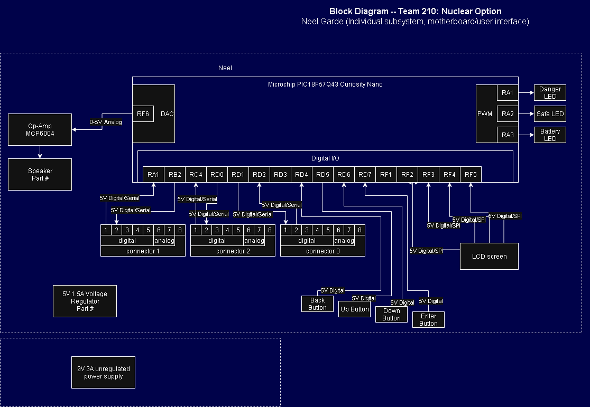

## Overview
The main contribution to this project by myself is the motherboard unit, which will connect, synchronize and provide input/output to the user via buttons, lights, a screen, and a speaker.

* power levels: All components will be running at 5V, input source is a 9V battery
* sensors: 4 buttons will be used for user inputs
* Actuator: A speaker will be used for warnings
* team connections: 3 other teammates will connect via digital signaling to give sensor data in numerial format via UART
* Power source: 9V battery

## Block Diagram 

Link to block diagram:
https://viewer.diagrams.net/?tags=%7B%7D&lightbox=1&highlight=0000ff&edit=_blank&layers=1&nav=1&title=EGR340_F210_Garde.drawio&dark=auto#R%3Cmxfile%3E%3Cdiagram%20name%3D%22Page-1%22%20id%3D%22D7A3hRXi8sjnXgM3Vncy%22%3E7V1de6q4Fv41Ps%2FMhX0gfIiXrbZ7%2BpzuvXvaM3vPzB1VVE7VeBCr9tefgAEhK4gKJNGZfbELMaC8yfp4V7IWLaM323wJ3MXkKx560xbShpuW0W8hpHdtg%2FyJWra7lo5m7RrGgT%2BknfYNr%2F6nRxs12rryh94y1zHEeBr6i3zjAM%2Fn3iDMtblBgNf5biM8zX%2Frwh17oOF14E5h609%2FGE52rY6l7dt%2F8%2FzxJPlmXaOfvLmD93GAV3P6fdOoU3voBu%2B%2FtJAxiv%2B1UI%2F0JKeapiHT%2FXV35cxNvobeajlxh3idaTLuW0YvwDjcHc02PW8awZ4gurvuoeDT9JECbx4ec8H9bDZ7tgZr%2BxM%2Fd9c%2Fnrf9ybitO7vbfLjTFcXqqz8I8GDiL0jz82NPdx6szr9NMgG03irw8dIPt%2BT4mzvH9LnCbQJzDJQXfZ%2FWMu7WEz%2F0XhfuIPp0TSYWaZuEsyk508nhhxeEPhmiW4LpnLSFOOow8qfTHp7igLTM8ZxcejfDH%2B5b%2FBXRZYG39D%2Bz5zh0w8w5mbpe9twb%2BtnTKR68p7%2BQTrfMxxBUinP0a71NpomC%2FMXDMy8MIkjop20jmfVUWHSLCst6P%2FU6Bu0zyUw7lMw6l073cXrz%2FbiSAzq0%2FGF%2BetM6wedm%2FW3yL%2FR7H3U%2F%2FtQHbb0DxsobEgmhpzgIJ3iM5%2B70ft96lx%2FNfZ8nHI1UDNd%2FvTDcUnF3VyHOj7C38cM%2FostvLHr2J71ZdNzfZE%2B29GT3O6MfVzjNadMSr4KBd2Bum%2FShQzcYe%2BEhdPjjGXhTN%2FQ%2F8j%2BENzTxpbdB4G4zHRbYn4fLzJ2fo4b9NDHzk8SyGelluut2tf4mqx3Y%2Fge7k4Pd8%2B2nYArU%2BbPSRED5WD%2FIed8fE5mdcqfsk%2FtGbFNumrlUgQzIDPECjmaZ%2BcPhbkZndEc02egYkZtbdy2rn04%2FIOypZaIX77V6dmIeEL1ibaHdOGaiICj4FJbT5t9%2BRJMueDRaknnP6o7TBu6gZGUG7o4YStJytwpDPK9mGGrQwcxstjoa0MA2RwEbNehfLmAOnOnPP79WgymZ9lNvFNaDmsHoJJ0Dm8OBTdcbw82Sabf0rNVKbRjfbhHUg%2B0f2ZPMVdHp%2FrL4LG%2FvzjFvjgHNG7%2BjyTWqFQxetTE1gCy0kD2N5vDQ%2FyCH4%2Bjw5VZPWsm3ZD6QrlsMp1xKTKHKxQSA9t35mJhCpD3d96UDZlrlgAnVxroNWQ9AKWJ9i8KnL3IHTqEJHcblMiBN0Hm42M3h0gW40AfF0WTSAUiVCN8bJr7CjDvHSoatHGR5GCajmsFwWODPKote4odCOU0DI3ne2hiYOgDTJZYcjy8Hyw0DXDG2PKPRILTQJa0o382KMRKLDnRSoImQjc6mcCoJBgs6IIaqYJnSwbIAWKaqYNnSwbIBWJARKgKWIx0sGJWxVQUrNYfy0IIcAAbJVUFLvoqHzMBRFi3pOt6BHACA1Ti%2FRIzHqQC%2FdKA7n%2BWXFT2syl69czzIEjGEfrsa%2FPIE9JThl5xYpBL88gQsVeWXnKikIH55nhgLthCQBQjil6dPLenOhwNZgCB%2BeTpY8n0PyAIE8cvTwZLOLx1IAgTxy9PBks4vHcgBBPHLCuZQGlpdyAEE8csz0JKu4ruQGQjil2egJVvHIw4HAGA1v36pGr1EHG8%2BSy8r%2BgxVnfr9qClMLxHHbVeCXp6Cnir0EnG8fBXo5SlYKkovEYcTiKGXZ4qxYAMBSYAYennG1JLteyAOCRBDL88AS77rAUmAGHp5Bliy6SXicAAx9PIMsGTTS8ShAGLoZRVzKA8tSAHE0Mtz0JKu4ruQGYihl%2BegJVvH61DFpxk52iO55fdq0HFS%2FPi5gBDjM5LxWMe1y0nG0znwNkaxTMiw4s3u9c7G05FKrRVFykAQqab2tfMzpyAoIpI%2F0kSOfe5GmrZYmshRT%2BIiBb40s4NuU4Rj2mzqYhuxsR8qQEXJhW02s4i5oKH0Qiho%2BfTCh1cv8K8mz%2FCweGs3Zifx1OkgtOmpwnmGMH7CSxW6Q4qmCrWRJU%2Bn8hGFXPelVzuBOwMoXTXjA0GRljGffFKWeSjNYFnOsQZrFxGtYLAqDarJ2U58xRbBLLEIVsfOWwRDdYNgcdRXX5OvvvSOaupLauL0pamv7pHqi646CPe3dbY6R5m%2FjWS423DN4ZqVa4Eh25f10Mwkonkx%2FrYFIz8vfQVCE7qhmBuNupwgTh%2FJR0piDKcAKEjhXvq1L6%2BdDpRqxMxAUH3muG4GLft%2Fq6ho3N0Iz8P2MjbGt6SDbi82%2Bw%2F3JHh3k7fzbxEXTYs1uTsO3Bk5arfJf%2F%2Fx4uOIusUXf1sNpp4bkKPvi9CPqgClpPyN%2FTUsUa%2FhQb95cdHCL24w9MjfXx7n5Hb%2BcBWHrZert%2BV2GXqzXbG%2BGQ4nXvCGSV%2FyS1bLuFaGH9mZEZl0vx4ZTiBzLczPzGUY4HePCW5z4t3H2zaeKOSFJQKHemS6XZfC1fIVqRL%2FI1uxo6l9SXxzC5drFC1gl%2FFnOzmHNg0u1%2BrQPj3qHT2cfV9i%2FefjX73hz9HnoJ2s5Zbz8a4Mf1ZnKugk5bkKa9M5p7m%2FZvdQ94a8X7h6fYW17JzDakO76epGJwd%2BW6WYwkFhyYzc74uWMqXsWFnh7NNoqngSfw50L1ATN6SISyuL1rI8V64%2Fu8xg7wwEvWo%2F3pX1tHNY77IZx6f2N7XD%2FbsHuzek1zlbuK5Prxe4AXu97hhdJ6%2FXUTW9nq4M5%2B7KXN%2Bg0ocrAdwihEjRlUW2CCHPQ28s4MwFtIS%2BJoAalwKoJRnQRNn9DUuf5swqFxuda6NrN7QmE0dPt%2B%2BWGNq6tBRnS%2ByrO4qiGyrW9eRGCYSKDAzA%2FiMyCTaGJJGxBYsM3Ol754bE59qqKjUcQyOU0HF2QgsldB2VGF1paC1Z%2BCmlfqig7r%2BYnS4GXHZhF2OfH7njfnHkBZUGpUzNZoJS9DvVCEpxH0pOlOWS5EvKVgzDzi%2BMlL1WBcQsRLxXxSjf%2BHw1wl8audAsK7%2FJTaVdGPzhk8r8tBvU9NuaKgp%2B1S2k5wk%2Bs65hGiWCz7h5TP%2BGBB86v9cq%2BDs4Dwq%2BlpR4PVfUkzB2%2FoIGBV9OwlMi%2BDn%2Bio4lsBfgKRTsg25WYSCGCJu0Ok2hwmD6G%2FSlYM0qDPT3URglW14ITUBa3lNQiiUcEoHM8D31%2BtFgDQLPk792zb4J0%2BS8%2BUfnJd9ajYUI4TLFbt8YgxTc2lXnlq0aoG3rDBPhJdlz40hWDdAWvkWT2ehZS2YZRwsA6A7gpFhmBtS4vHWyvtXcOlklPCXuxC7eYVEOp60onKrlDUGDwoWzoyicbKKMdDx1yVxeyouX03dLle4%2FNaW45m2DeTmyUbJRqQ3k1BHA5s1yNn9NCVXlhL6j53cLqbW3lPtQ6FLEXyyhP%2FzKgHK1UbDkIyiLvHxt7ZrkEh2US%2B2GMApGLJXizdxngoXl%2FhHLImFLi4mWp0d3q5rzanLJKeZ%2FxXJZsP6ZsZddNkSgulwiSI77eD1v1ZmMUY1fMKs66c57aZt3oI%2F48lBLxnatOEnnYQgS25cH6JwJx0m1mnuIk679UEu6diWclAs7IZg%2F8PIgP9qpXDyJk9X%2B8lBLDeRqUUzV4kSGlE2YrbO8RP4DUIEoXY2VsxjL2m27ZPeGXq1%2FWUAJFDQREU8yYHWX60tlM0p3gzoOWwdT%2BTCScVS22n08HntfWckIPbvNweZUUhfqQSea4TC2%2FdteE4AmshTsHrSWBU%2FWtumcRXeHg3C6dlI%2FxNCBFLmZOT05JcemFqNoHZsnbhUE2cQETixIjrR2bBpu%2BW8rukjLYBUk42d3DJr5gImtumFIJljOva7lrRn16iCh6clcoKREfOtUJehYVSK1wm7yMw9b0%2B%2BL9u1scUQtsF3T194zcRNMRT0aoj7zWgNxyGS6O0tItSzrqLrprwvPfY88xiOH4dkNIq3WQg3m8Nc7EgZH7QgeiaPKIsS2Vr%2BxouJ2P%2FA0dMdRjveLN14RmcXXNEIms%2FPC4mS%2FCh4huGpUDSZOub%2Bhu5zEl9c20RkYdd5E577s0mrOxMLwwuUBaXPmYwpZji01hqMNfbpupB%2Fi0perebDTCgQF8qB4HTP%2B5WqxmG4VkG7E%2BM9Oc5aQnAY4KgC696fJM02%2B4mFES%2B7%2FDw%3D%3D%3C%2Fdiagram%3E%3C%2Fmxfile%3E