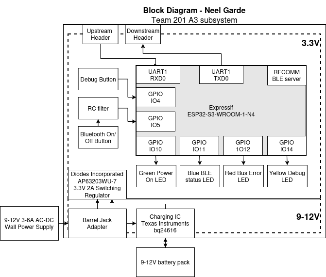

## Overview
Featured on this page is a block diagram for subsystem A2. This subsystem is responsible for being the onboard bluetooth relay, as well as serving as a backup onboard control panel. 
- The unregulated power section can be between 9-12V as needed. 
    - A barrel jack is used to supply power to the system or to supply to the battery charging circuit, which can send power directly to the system as needed as well. 
    - A battery is connected through a charging IC circuit, allowing it to discharge or charge within safe operating conditions
    - A 3.3V regulator supplies the voltage necessary for the ESP32 to function.
- Data transmission within the robot is handled through 8-pin UART bus connectors.
- Programming is done via a microUSB interface connected to the ESP32 microcontroller.
- In order to facilitate remote control, the ESP32's bluetooth low-energy (BLE) module is used to communicate bidirectionally with subsystem A2 to send sensor data and recieve user input data.

## Block Diagram 
