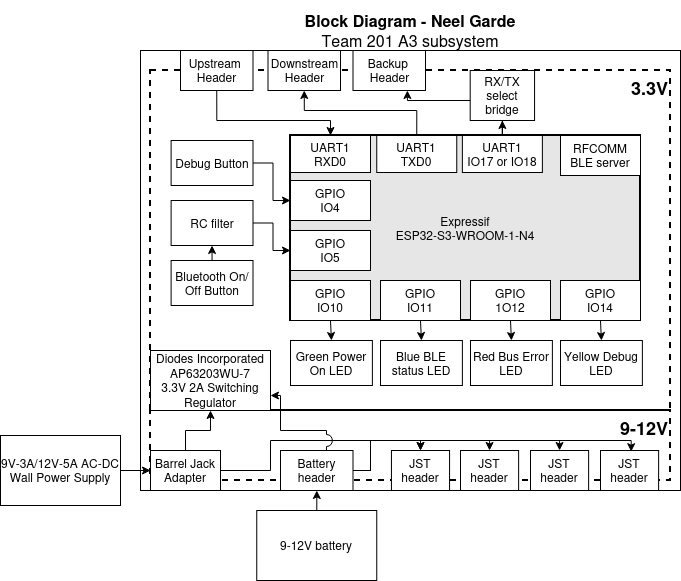

## Overview
Featured on this page is a block diagram for subsystem A2. This subsystem is responsible for being the onboard bluetooth relay, as well as serving as a backup onboard control panel. 
- A 9V (can be raised to 12V or higher if needed) power section handles power sharing across other team boards
    - 9V power is shared through the daisy-chain headers (low current, max 4A total) and through 4 high-current JST headers (10A each, in practice no supply on our system can output this much)
    - A removable battery is connected via a JST header
    - A wall power source (either 9V 2A or 12V 5A) can be connected via a barrel jack.
    - A 3.3V regulator supplies the voltage necessary for the ESP32 to function.
- Data transmission within the robot is handled through 8-pin UART bus connectors.
- Programming is done via a microUSB interface connected to the ESP32 microcontroller.
- In order to facilitate remote control, the ESP32's bluetooth low-energy (BLE) module is used to communicate bidirectionally with subsystem A2 to send sensor data and recieve user input data.

## Block Diagram 
