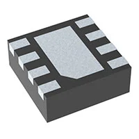
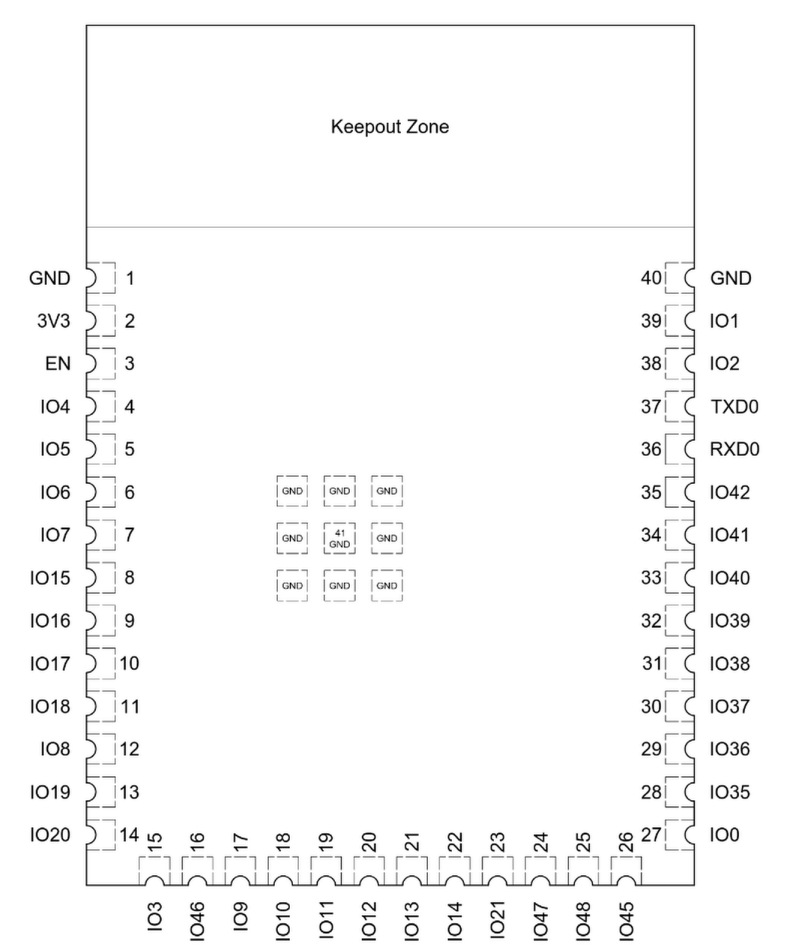

## Module's Selected Major Components

The following sections are the selected major components necessary for subsystem A3:

### Power Management

1. AP63203WU-7 buck switching regulator

    

    * $0.71/each
    * [link to product](https://www.digikey.com/en/products/detail/diodes-incorporated/AP63203WU-7/9858426)

    | Pros                                      | Cons                                                                   |
    | ----------------------------------------- | ---------------------------------------------------------------------- |
    | Inexpensive                               | Current capacity significantly higher than necessary, could be smaller |
    | Wide input voltage range                  |                                                                        |
    | Low EMI                                   |                                                                        |

2. MP2317GJ-Z buck switching regulator

    

    * $1.92/each
    * [link to product](https://www.digikey.com/en/products/detail/monolithic-power-systems-inc/MP2317GJ-Z/7361391)

    | Pros                                      | Cons                                                                   |
    | ----------------------------------------- | ---------------------------------------------------------------------- |
    | Adjustable output                         | Expensive                                                              |
    | Small footprint                           | No EMI specs mentioned                                                 |
    |                                           |                                                                        |

3. TPS62172DSGR buck switching regulator

    

    * $1.32/each
    * [link to product](https://www.digikey.com/en/products/detail/texas-instruments/TPS62172DSGR/2833456)

    | Pros                                      | Cons                                                                   |
    | ----------------------------------------- | ---------------------------------------------------------------------- |
    | Very compact                              | Leadless design requires additional assembly equipment                 |
    | Low noise                                 |                                                                        |

The AP63203WU-7 will be selected due to it's affordability, ease of assembly, and wide input voltage level.

### Microcontroller Selection

The structure of the EGR314 course this project is being developed in requires the use of either a Microchip PIC-family microcontroller or an Expressif ESP32-S3-WROOM-1-N4 module. As the primary function of this device is bluetooth communication, and the PIC family does not include any units with built-in wireless functionality, the ESP32 will be chosen. Additional benefits of the ESP32 include a more reliable development environment by leveraging open-source tools such as mpremote, Visual Studio Code and Python/MicroPython. 

The pinout of the ESP32-S3-WROOM-1-N4 module is as follows:

Subsystem A3's role on the team is to provide a BLE GATT server onboard the robot, and route data between the daisy-chain bus and the BLE communication to the controller unit (systems A1 and A2). To do this, A3 must be capable of recieving unregulated power from the robot's onboard daisy-chain bus and regulate it to it's required 3.3V. No additional sensors, actuators or displays will be used. Simple debug buttons and LEDs will be used to assist with testing.

To perform the necessary bluetooth functions, the aioble library will be used. This library provides a wrapper over MicroPython's bluetooth API, making development simpler and more reliable. This library allows modules for client and server to be loaded individually, reducing the program size.

### Power Budget
This section is WIP. The datasheet for the ESP32 module lists 500mA as the recommended minimum, which the chosen power supply well exceeds.

