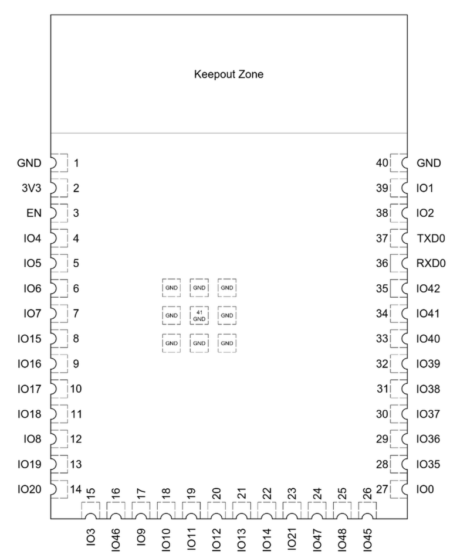
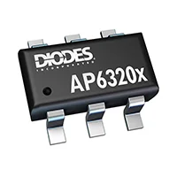
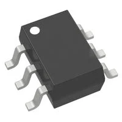
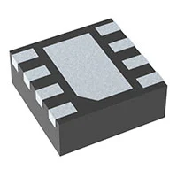
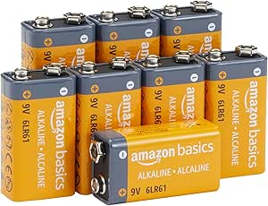
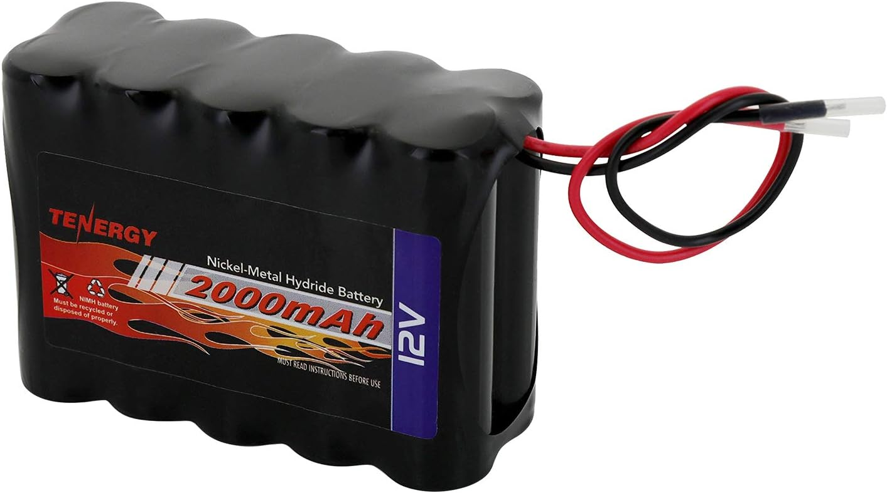
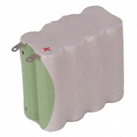

## Module's Selected Major Components

The following sections are the selected major components necessary for subsystem A3:

### Microcontroller Selection

The structure of the EGR314 course this project is being developed in requires the use of either a Microchip PIC-family microcontroller or an Expressif ESP32-S3-WROOM-1-N4 module. As the primary function of this device is bluetooth communication, and the PIC family does not include any units with built-in wireless functionality, the ESP32 will be chosen. Additional benefits of the ESP32 include a more reliable development environment by leveraging open-source tools such as mpremote and Python/MicroPython.

The pinout of the ESP32-S3-WROOM-1-N4 module is as follows:

Subsystem A3's role on the team is to provide a BLE GATT server onboard the robot, and route data between the daisy-chain bus and the BLE communication to the controller unit (systems A1 and A2). To do this, A3 must be capable of recieving unregulated power from the robot's onboard daisy-chain bus and regulate it to it's required 3.3V. No additional sensors, actuators or displays will be used. Simple debug buttons and LEDs will be used to assist with testing.

To perform the necessary bluetooth functions, the aioble library will be used. This library provides a wrapper over MicroPython's bluetooth API, making development simpler and more reliable. This library allows modules for client and server to be loaded individually, reducing the program size.

### 3.3V Power Regulator

1. AP63203WU-7 buck switching regulator

    

    * $0.71/each
    * [link to product](https://www.digikey.com/en/products/detail/diodes-incorporated/AP63203WU-7/9858426)

    | Pros                                      | Cons                                                                   |
    | ----------------------------------------- | ---------------------------------------------------------------------- |
    | Inexpensive                               | Current capacity significantly higher than necessary, could be smaller |
    | Wide input voltage range                  |                                                                        |
    | Low EMI                                   |                                                                        |

2. MP2317GJ-Z buck switching regulator

    

    * $1.92/each
    * [link to product](https://www.digikey.com/en/products/detail/monolithic-power-systems-inc/MP2317GJ-Z/7361391)

    | Pros                                      | Cons                                                                   |
    | ----------------------------------------- | ---------------------------------------------------------------------- |
    | Adjustable output                         | Expensive                                                              |
    | Small footprint                           | No EMI specs mentioned                                                 |
    |                                           |                                                                        |

3. TPS62172DSGR buck switching regulator

    

    * $1.32/each
    * [link to product](https://www.digikey.com/en/products/detail/texas-instruments/TPS62172DSGR/2833456)

    | Pros                                      | Cons                                                                   |
    | ----------------------------------------- | ---------------------------------------------------------------------- |
    | Very compact                              | Leadless design requires additional assembly equipment                 |
    | Low noise                                 |                                                                        |
### Battery
No commercially available single cell has sufficient capacity to power the whole drone (estimated 5A peak theoretical draw) for a reasonable time of at least an hour. 12V is our maximum voltage, but the only sufficient cell type that can deliver this is lead-acid, which are heavy and expensive. As such our options are to use a pack of multiple cells. This course's structure does not allow packs with management circuitry built-in, so 12V Li-ion packs with a BMS are not an option. Options will be restricted to disposable packs or externally rechargable packs without an onboard BMS.

A more mature version of this system could integrate it's own charging and battery control circuit [using a BQ24616RGER IC](A3V3.pdf). The whole project for this proposed system can be downloaded [here](A3V3.zip). This project was significantly too complex for the remaining time in the course, and should have been proposed as the primary functionality from the beginning.

1. Amazon Basics 8-pack 9V batteries

    

    * $12.69/each
    * [link to product](https://www.amazon.com/Amazon-Basics-Performance-All-Purpose-Batteries/dp/B00MH4QM1S)

    | Pros                                           | Cons                                                                   |
    | ---------------------------------------------- | ---------------------------------------------------------------------- |
    | Lower price/quantity compared to other options | No energy rating provided (assumed to be between 200-500mAh)           |
    | Simple connection                              | Can't power 12V subsystems                                             |

2. Tenergy 12V NIMH rechargable pack

    

    * \$43.98 total - \$21.99 for battery pack, $21.99 for charger. 
    * [link to battery pack](https://www.amazon.com/Tenergy-Capacity-Rechargeable-Replacement-Equipments/dp/B077Y9HNTF) 
    * [link to charger](https://www.amazon.com/Tenergy-RC-Airplanes-Batteries-Compatible-Alligator/dp/B001AVUAVC) 

    | Pros                                                       | Cons                                                                   |
    | ---------------------------------------------------------- | ---------------------------------------------------------------------- |
    | High capacity, can power subsystem for the target duration | Less common battery chemistry, harder to find a charger                |
    | Rechargable                                                | Expensive with charger                                                 |
    | Can power 12V systems                                      |                                                                        |

3. 12V alkaline pack
    
    

    * $6.20/each
    * [link to product](https://www.digikey.com/en/products/detail/energizer-battery-company/EN91F2X4/704913)

    | Pros                                                        | Cons                                                                  |
    | ----------------------------------------------------------- | --------------------------------------------------------------------- |
    | High capacity, can power subsystem for the target duration  | Non-rechargable                                                       |
    | Cheap, can purchase multiple units                          |                                                                       |

The Tenergy 12V NIMH pack and it's charger will be chosen for it's rechargability. While the 12V alkaline pack offers a competitive price to overlook it's disposable nature, crimping new leads to it every time the pack has to be changed will be too time-consuming, and using aligator clips is not a safe option for the current draw the system is capable of. The 9V batteries do not offer a competitive enough price or convenience advantage to outweigh the added complexity of having to supply an additional power source for our 12V systems.

