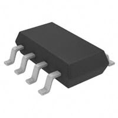
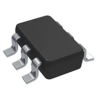
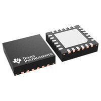
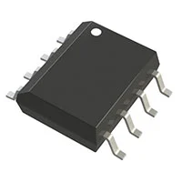
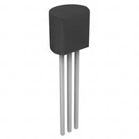

## Module's Selected Major Components

The following sections are the selected major components necessary for subsystem A3:

### 3.3V Power Regulator

1. AP63203WU-7 buck switching regulator

    

    * $0.71/each
    * [link to product](https://www.digikey.com/en/products/detail/diodes-incorporated/AP63203WU-7/9858426)

    | Pros                                      | Cons                                                                   |
    | ----------------------------------------- | ---------------------------------------------------------------------- |
    | Inexpensive                               | Current capacity significantly higher than necessary, could be smaller |
    | Wide input voltage range                  |                                                                        |
    | Low EMI                                   |                                                                        |

2. MP2317GJ-Z buck switching regulator

    

    * $1.92/each
    * [link to product](https://www.digikey.com/en/products/detail/monolithic-power-systems-inc/MP2317GJ-Z/7361391)

    | Pros                                      | Cons                                                                   |
    | ----------------------------------------- | ---------------------------------------------------------------------- |
    | Adjustable output                         | Expensive                                                              |
    | Small footprint                           | No EMI specs mentioned                                                 |
    |                                           |                                                                        |

3. TPS62172DSGR buck switching regulator

    

    * $1.32/each
    * [link to product](https://www.digikey.com/en/products/detail/texas-instruments/TPS62172DSGR/2833456)

    | Pros                                      | Cons                                                                   |
    | ----------------------------------------- | ---------------------------------------------------------------------- |
    | Very compact                              | Leadless design requires additional assembly equipment                 |
    | Low noise                                 |                                                                        |

### 5V Power Regulator

1. AP63205WU-7 buck switching regulator

    

    * $0.71/each
    * [link to product](https://www.digikey.com/en/products/detail/diodes-incorporated/AP63205WU-7/9858424)

    | Pros                                             | Cons                                                                   |
    | ------------------------------------------------ | ---------------------------------------------------------------------- |
    | Shares a footprint with AP3203WU-7 used for 3.3V | Current capacity significantly higher than necessary, could be smaller |
    | Wide input voltage range                         |                                                                        |
    | Low EMI                                          |                                                                        |

2. MP2144GJ-Z buck switching regulator

    

    * $1.67/each
    * [link to product](https://www.digikey.com/en/products/detail/monolithic-power-systems-inc/MP2317GJ-Z/7361391)

    | Pros                                      | Cons                                                                               |
    | ----------------------------------------- | ---------------------------------------------------------------------------------- |
    | Adjustable output                         | Expensive                                                                          |
    | Small footprint                           | More pins than other options (due to adjustment function), increases assembly time |
    |                                           |                                                                                    |

3. TPS62172DSGR buck switching regulator

    

    * $1.76/each
    * [link to product](https://www.digikey.com/en/products/detail/texas-instruments/LMR50410Y5FQDBVRQ1/13563002)

    | Pros                                      | Cons                                                                   |
    | ----------------------------------------- | ---------------------------------------------------------------------- |
    | Very compact                              | Expensive                                                              |
    | Appropriate current rating                |                                                                        |

The AP63205WU-7 will be selected due to it's shared footprint with the selected 3.3V regulator and it's wide input voltage.

## 12V power regulation
One member of our team will be using 12V power for motor drivers. To keep using a single central battery, either a 12V battery pack can be used (12V cells are not an option, as the only commercially availible 12V cells are lead-acid, which are too heavy for a small ROV boat.), or a boost converter can be used. Creating a 12V pack would require the use of a battery charging controller to balance the cells, adding significant complexity to the system. This complexity is further increased by all available charging ICs capable of meeting our needs from our main supplier (Digikey) being leadless or castellated, assembly of which which is not within the scope of this class. Using a 9V battery and a boost converter keeps the system within standard class regulations, and reduces complexity.

1. BQ24616RGER charger IC

    

    * $5.28/each
    * [link to product](https://www.digikey.com/en/products/detail/texas-instruments/BQ24616RGER/2596770)

    | Pros                                                 | Cons                                                                               |
    | ---------------------------------------------------- | ---------------------------------------------------------------------------------- |
    | Can handle charging and discharging for series cells | Expensive                                                                          |
    | Small footprint                                      | Adds significant complexity due to required MOSFETS and reference circuits         |
    | High current capacity                                | Castellated leads may not pass class requirements                                  |

2. LT1109ACS8-1c2#PBF boost switching regulator

    

    * $9.32/each
    * [link to product](https://www.digikey.com/en/products/detail/analog-devices-inc/LT1109ACS8-12-PBF/890895)

    | Pros                                      | Cons                                                                   |
    | ----------------------------------------- | ---------------------------------------------------------------------- |
    | Reasonable current capacity (2 required)  | More pins than necessary                                               |
    | Surface mount                             |                                                                        |

3. LT1109CZ-12#PBF boost switching regulator

    

    * $6.57/each
    * [link to product](https://www.digikey.com/en/products/detail/analog-devices-inc/LT1109CZ-12-PBF/961468)

    | Pros                                      | Cons                                                                   |
    | ----------------------------------------- | ---------------------------------------------------------------------- |
    | Simple design                             | Through-hole mounting                                                  |
    |                                           | Lower current capacity (3 required)                                    |

### Microcontroller Selection

The structure of the EGR314 course this project is being developed in requires the use of either a Microchip PIC-family microcontroller or an Expressif ESP32-S3-WROOM-1-N4 module. As the primary function of this device is bluetooth communication, and the PIC family does not include any units with built-in wireless functionality, the ESP32 will be chosen. Additional benefits of the ESP32 include a more reliable development environment by leveraging open-source tools such as mpremote, Visual Studio Code and Python/MicroPython. 

The pinout of the ESP32-S3-WROOM-1-N4 module is as follows:

Subsystem A3's role on the team is to provide a BLE GATT server onboard the robot, and route data between the daisy-chain bus and the BLE communication to the controller unit (systems A1 and A2). To do this, A3 must be capable of recieving unregulated power from the robot's onboard daisy-chain bus and regulate it to it's required 3.3V. No additional sensors, actuators or displays will be used. Simple debug buttons and LEDs will be used to assist with testing.

To perform the necessary bluetooth functions, the aioble library will be used. This library provides a wrapper over MicroPython's bluetooth API, making development simpler and more reliable. This library allows modules for client and server to be loaded individually, reducing the program size.

### Power Budget
This section is WIP. The datasheet for the ESP32 module lists 500mA as the recommended minimum, which the chosen power supply well exceeds.

