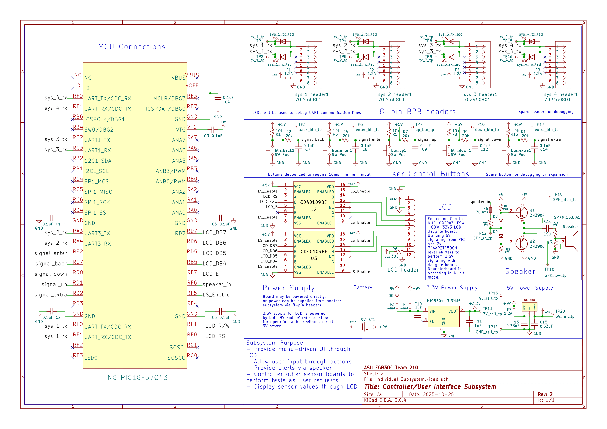

## Overview

This schematic is design to support a water-quality monitoring system. This subsystem functions as a user interface, supporting up to 4 sensor boards to be added to it. It features a speaker to alert the user of dangerous levels, as well as a screen and button interface. 

**Figure 1:** Controller subsystem schematic.

## Design Process

| Element | Design Process |
| :---- | :---- |
| MCU pin assignments | Allocated by datasheet |
| 8-pin header pin assignments | Project specification |
| Switch pull-up resistors | From my research, the pull-up size can be within an  acceptable range and min and max size can be calculated with the current and capacitance of the MCU pins. If the MCU is not especially sensitive, 10k is a generally accepted standard for 5V microcontrollers. |
| Debouncing low-pass filter (RC) | Using the relationship debouncetime \= 5RC, and an arbitrary debounce of 10 ms (assumed to be a reasonable time for a human to make a confident input without becoming annoying), and a capacitor value of 0.1 uF to keep physical size down, I calculated a 20kOhm resistor would be suitable. |
| LCD header pin assignments | Allocated by datasheet |
| Speaker design | Design from in-class lab updated with datasheet for specific speaker used |
| Power supplies | Basic design from datasheets. A second 5V input with a diode and fuse was added to the 3.3V regulator to allow functioning when being powered by another subsystem. The diodes and fuse are to prevent the 9V supply from being connected to the 5V rail. |

## Resouces

The schematic as a PDF download is available [*here*](IndividualSubsystemPDF.pdf), and the Zip folder of the project [*here*](Individual Subsystem.zip).

