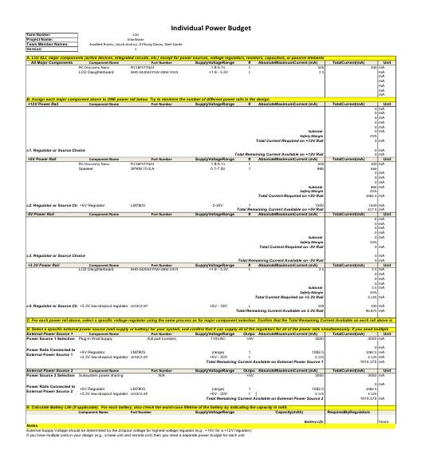

## Overview
As this subsystem involves multiple active components and an actuator, a power budget was required to ensure that the two main rails and regulators would be sufficient, and that our plan of sharing a 5V rail from the pH sensor subsystem would be feasible.

## Conclusions

The power draw of the controller subsystem is minimal when the speaker is off, and both wall-power and power-sharing with teammates should be no issue. When the speaker is on, it is still well within safety. It can be assumed the the power draw from teammate subsystems will be minimal since there are no actuators involved.

## Resouces

The power budget as a PDF download is available [*here*](IndividualPowerBudget.pdf), and a Microsoft Excel Sheet [*here*](Group210PowerBudget.xlsx).