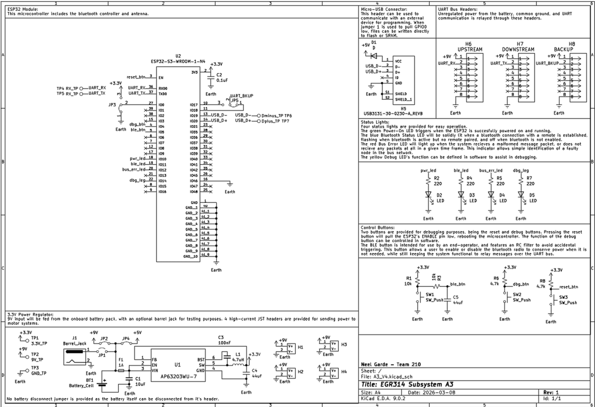

## Overview

This schematic is design to function as an onboard bluetooth low energy server for connecting to a remote control unit. 
4 high-current JST headers are provided for motor subsystems that may require more power from the battery, capable of 10A each. The battery itself is on a disconnectable JST header as well, and jumpers are provided for enabling/disabling shared power, USB power and the barrel jack supply.
A spare 8-pin header is provided for redundancy. A solder bridge is used to control whether it is RX (upstream) or TX (downstream).

{style width:"350" height:"300;"}
**Figure ##:** Showing Subsystem A3's schematic

## Resouces

The schematic as a PDF download is available [*here*](A3V4.pdf), and the Zip folder of the project [*here*](A3V4.zip).
