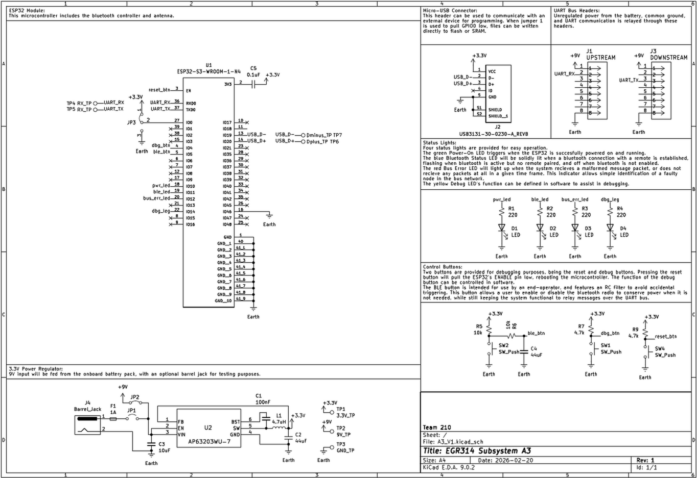

## Overview

This schematic is design to function as an onboard bluetooth low energy server for connecting to a remote control unit, as well as supply battery power to the rest of the vehicle's subsystems.
The BLE systems are handled by the ESP-32-WROOM module alone.
Power distribution is handled by a batter charging circuit, where an IC switches 5 MOSFETs for safe charging and discharging of the battery. A barrel jack is used for charging the battery, and can be used to power the whole system if needed. 
As a redundancy for the charging circuit failing, a solder bridge allows the battery power to be sent directly to the necessary circuits without going through the charging circuit. If using a single-cell battery without charging it, this is safe to do.

{style width:"350" height:"300;"}
**Figure ##:** Showing Subsystem A3's schematic

## Resouces

The schematic as a PDF download is available [*here*](A3V1.pdf), and the zip folder of the project [*here*](A3V1.zip).