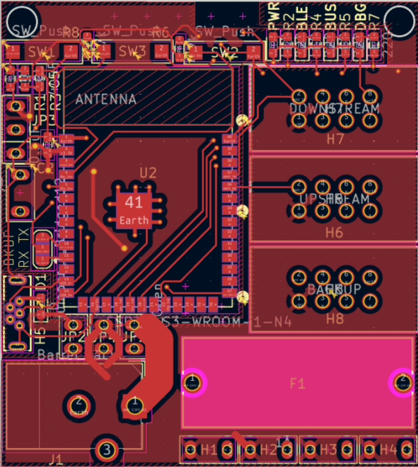
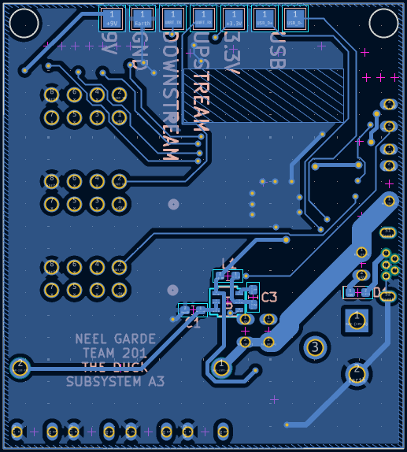

## PCB

The PCB for subsystem A3 contains all components except for the battery, which is external and attached via a header. The PCB was made in KiCAD and will be manufactured by JLCPB. The PCB can be downloaded as [gerber files](NeelGarde201.zip) or a [KiCAD project archive](A3V4.zip).
Front: 

 
Back: 
